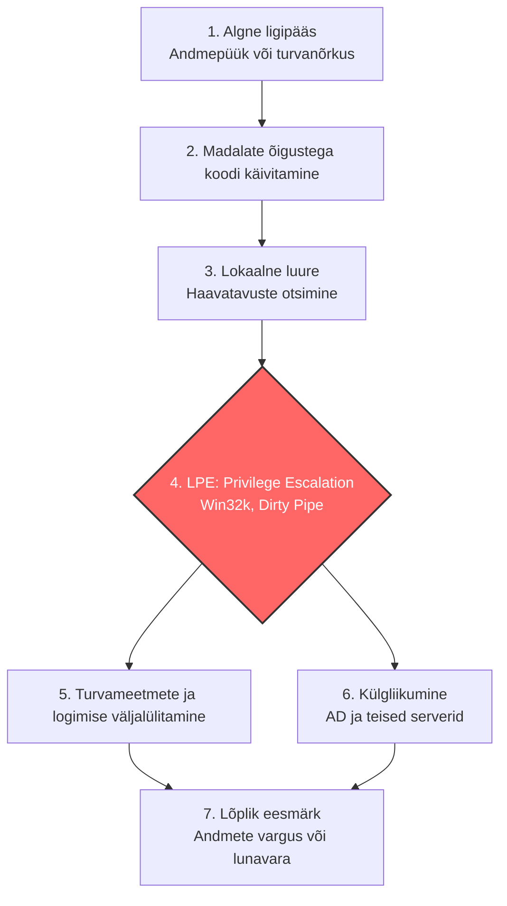

LPE (Local Privilege Escalation) vead on küberrünnaku ahelas kriitiliseks "sillaks" – need muudavad tüütu, kuid lokaalse sissetungi täielikuks süsteemi ja potentsiaalselt kogu võrgu ülevõtmiseks.

Ilma LPE-ta on ründaja masinas justkui külaline: ta näeb vaid konkreetse teenuse faile, ei saa lugeda teiste kasutajate andmeid ega lülitada välja turvalahendusi. Vead nagu Dirty Pipe (Linux) ja Win32k (Windows) on võtmed, mis annavad sellele külalisele koheselt administraatori (root/SYSTEM) õigused.

Vaatame, kuidas see samm-sammult tüüpilises ründestsenaariumis välja näeb (toetudes MITRE ATT&CK raamistikule):

1. **Algne ligipääs (Initial Access):** Jalg ukse vahele saamine.
Ründaja leiab tee süsteemi. See võib toimuda andmepüügi (phishing) e-kirjaga avatud faili, lekkinud parooli või paikamata avaliku veebiteenuse (näiteks nõrgalt konfigureeritud IIS veebiserveri) kaudu.
**Tulemus:** Ründajal on süsteemis madala taseme õigused (nt tavakasutaja või piiratud `www-data` teenusekonto).

2. **Luure ja ettevalmistus lokaalses masinas (Discovery):**
Ründaja kaardistab enda ümbrust (näiteks kasutades lokaalseid skripte või Nmap käske sisevõrgu uurimiseks). Uuritakse, milline operatsioonisüsteem jookseb, milline on kerneli versioon ja millised tsentraalse logimise (nt E-ITS nõuetele vastavad) reeglid on aktiivsed. Siin avastab ründaja, et masinas on paikama Linuxi kernel või haavatav Windows.

3. **Lokaalne õiguste eskaleerimine (Privilege Escalation):** Rünnaku kriitiline murdepunkt.
Ründaja käivitab varasemalt leitud vea baasil oma programmi.

* **Dirty Pipe'i** puhul kirjutatakse andmed otse süsteemi paroolifaili ja tehakse endale *root* konto.
* **Win32k** puhul manipuleeritakse tuuma mäluga ja tõstetakse enda pahatahtliku protsessi õigused *SYSTEM* tasemele.
**Tulemus:** Ründajal on masina üle täielik ja piiramatu kontroll.

4. **Kinnistamine ja kaitsemeetmetest möödahiilimine (Defense Evasion):**
Kuna ründajal on nüüd kõrgeimad õigused, lülitab ta välja viirusetõrje (EDR/Defender), kustutab oma jälgede peitmiseks lokaalsed Syslog või Windows Event logifailid ja loob tagauksi, et süsteemile ka hiljem märkamatult ligi pääseda.

5. **Külgliikumine (Lateral Movement):**
LPE abil täielikult kompromiteeritud masin muutub sillapeaks teiste masinate ründamisel. Administraatori õigustega saab mälust välja lugeda teiste masinasse sisseloginud IT-spetsialistide paroole (näiteks tööriistaga Mimikatz). Nende paroolidega liigutakse edasi ettevõtte Active Directory domeenikontrolleritesse, kriitilistesse andmebaasidesse või virtuaalmasinate (nt Proxmox) haldusliidestesse.

# LPE (Local Privilege Escalation) Ennetamise ja Tuvastamise Kontrollnimekiri

See nimekiri on koostatud E-ITS (Eesti Infoturbestandard) parimate praktikate (sh DER.1, OPS.1, SYS.1) alusel, et kaitsta serveritaristut ja tööjaamu kohalike õiguste eskaleerimise rünnakute (nt Dirty Pipe, Win32k) eest.

## 1. Ennetavad meetmed (Prevention)

### Süsteemide paigamine ja elutsükkel (OPS.1.1.4)
- [ ] **Kerneli uuendused:** Automatiseeritud paikamisprotsess Linuxi ja Windowsi tuumadele (sh kriitiliste turvavigade *out-of-band* uuendused).
- [ ] **Virtuaalkeskkondade kaitse:** Hüperviisorite (nt Proxmox) regulaarne uuendamine ja haldusliideste isoleerimine eraldiseisvasse haldusvõrku.
- [ ] **Tarkvara inventuur:** Masinatesse on paigaldatud vaid minimaalselt vajalik tarkvara ja teenused (ründepinna vähendamine).

### Pääsuõiguste haldus ja karastamine (ORP.4 / SYS.1.2.2)
- [ ] **Vähimate õiguste printsiip (PoLP):** Tavalistel domeenikasutajatel puuduvad lokaalsed administraatori õigused.
- [ ] **Active Directory ja GPO:** GPO-de (Group Policy Object) abil on piiratud tarkvara paigaldus ja käivitamine standardkasutajate poolt. OU-d (Organizational Units) on loogiliselt ja turvaliselt eraldatud.
- [ ] **Linux SUID/SGID audit:** Süsteemides on kaardistatud ja vajadusel eemaldatud SUID/SGID bitid programmidele, mis seda reaalselt ei vaja.
- [ ] **Teenusekontod:** Veebiserverid ja rakendused (nt IIS, Apache) jooksevad piiratud õigustega teenusekontode (Service Accounts) all.

## 2. Tuvastavad meetmed (Detection)

### Tsentraalne logihaldus (DER.1 / DER.2)
- [ ] **Logide koondamine:** Kõikide serverite ja seadmete logid (Windows Event Logs, Linux Syslog) edastatakse reaalajas tsentraalsesse logiserverisse, vältimaks nende lokaalset kustutamist kompromiteeritud masinas.
- [ ] **Logide säilitamine:** Rakendatud on range logide säilitamise poliitika ja dokumentatsioon, mis vastab asutuse sisekorrale ja E-ITS nõuetele.
- [ ] **Ligipääsukontroll logidele:** Logiserverile on ligipääs ainult auditeerimiseks volitatud isikutel.

### Monitooring ja alarmeerimine
- [ ] **Kriitiliste failide jälgimine (FIM):** Automaatne teavitus süsteemifailide (nt `/etc/passwd`, `/etc/shadow`, Windowsi SAM andmebaas) ootamatust muutmisest.
- [ ] **Ebatüüpilised protsessid:** Teavitus, kui madala õigusega teenusekonto (nt `www-data`) käivitab ootamatult interaktiivse kesta (shell) või administraatori utiliidi.
- [ ] **Õiguste eskaleerumise sündmused:** Monitooring on seadistatud püüdmaks Windowsis edukat *SYSTEM* kontole lülitumist või Linuxis ootamatuid `su` / `sudo` kasutusi volitamata lokaalsete kasutajate poolt.

---

Siin on visuaalne ülevaade, kuidas LPE on keskseks ühenduslüliks algse ründe ja lõpliku kahju vahel:

> **Peamine järeldus:** LPE on sageli intsidentide lahendamisel määrava tähtsusega murdepunkt. Kui süsteemi tuum (kernel) ja tarkvara on korrektselt paigatud ning LPE katsed ebaõnnestuvad, on sissetungijal väga raske oma piiratud "liivakastist" välja murda ning intsidendi tagajärjed on oluliselt väiksemad.
